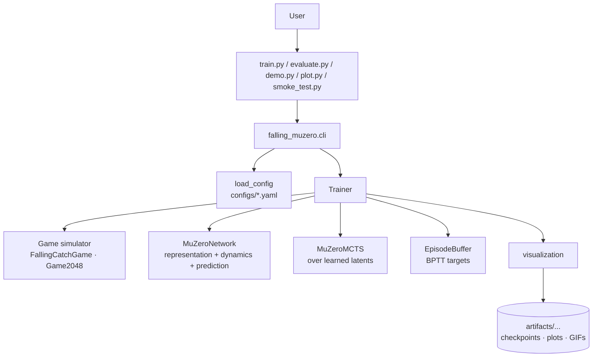

# A MuZero Knockoff — Falling Catch & 2048

A from-scratch MuZero-style reinforcement-learning system for two small
deterministic grid games. Same code base, three configurations:

1. **Falling Catch — no heuristic warm-start** (the headline experiment)
2. **Falling Catch — with heuristic warm-start** (the assignment-ready baseline)
3. **2048** (a harder deterministic extension)

The agent learns an **abstract latent model** of each game, plans inside that
model with **Monte Carlo Tree Search**, and is trained from self-play with
back-propagation through time. After training, only the actor — representation
+ prediction networks — is used at evaluation. No real simulator is consulted
inside the search tree.

> NTNU IT-3105 (Spring 2026), single-author project. Every plot, GIF, and
> diagram in this repository was produced from this code base.

## Headline numbers

| Setup | Best actor reward | Miss % | Random baseline | Heuristic baseline |
| --- | --- | --- | --- | --- |
| Falling Catch — **no heuristic** warm-start | **8.78** | **0.0%** | −3.97 | 9.17 (ceiling) |
| Falling Catch — heuristic warm-start | 9.17 | 0.0% | −4.58 | 9.17 |
| 2048 | best reward 43.0 / score ≈ 5,500 / max tile 512 | — | reward ≈ 11.9 | reward ≈ 183 (≈ 11k score) |

Source: `artifacts/<preset>/results/training_metrics.json`.

## Demo gallery

Falling Catch (no heuristic) actor — zero misses, learned from random warm-up:


2048 — learned actor (left) vs hand-written look-ahead heuristic (right):

| MuZero actor | Heuristic baseline |
| --- | --- |
|  |  |

A random baseline for honest comparison:


---

## What this is

Reinforcement learning is learning from interaction: an agent observes a
state, picks an action, gets a scalar reward, moves to a new state, and the
goal is the discounted sum of *future* rewards.

Three flavours of learner:

| Flavour | What it learns | Plans? |
| --- | --- | --- |
| Model-free | A policy or value, never a world model | No |
| Model-based (perfect) | Uses or learns a transition model with the real grid | Yes — needs the rules |
| **MuZero** | Learns an *abstract latent* model — only enough to predict reward, value, and policy | Yes — no real rules at search time |

MuZero sits in between. It does not use the real game rules and it does not
reconstruct the real grid; it just learns a latent that is informative enough
for MCTS to plan from. That is what this repository implements.

## The games

### Falling Catch — 5 × 5

A red object spawns at the top and falls one row per timestep. A blue paddle
on the bottom row moves `left`, `stays`, or moves `right`. Catching the object
gives `+1`, missing gives `−1`, plus a small distance-shaping term per step.
Episodes are 40 timesteps (= 8 catch opportunities), so the deterministic
near-optimal score is **9.17**.


### 2048 — 4 × 4 (deterministic)

The familiar sliding-tile game: swipe to merge equal tiles. The spawn
schedule is deterministic (a closed-form function of a counter), so the
search tree stays a normal action tree without stochastic chance nodes.
Reward is the merged tile value scaled by `merge_reward_scale`, with a small
penalty for illegal swipes.


## Architecture

The code follows the SimWorld ↔ AI separation the course requires.
Game simulators own state, transitions, and rewards; AI code only depends
on the shared `MuZeroGame` Protocol.



### The Trinet

Three small networks, jointly trained:

| Network | Role | Where it runs |
| --- | --- | --- |
| **Representation** `NN_r` | observation stack → latent vector | once per real observation |
| **Dynamics** `NN_d` | (latent, action) → (next latent, reward) | every MCTS descent + every BPTT unroll step |
| **Prediction** `NN_p` | latent → (policy logits, value) | every leaf in MCTS, every BPTT step |

The latent does not have to look like a real grid — it only has to carry
enough information to predict useful rewards, values, and policies. See
[`src/falling_muzero/networks.py`](src/falling_muzero/networks.py).

### Training loop (one episode)

1. **Plan** — `NN_r` builds the root latent. The root is expanded once with
   `NN_d` and `NN_p`, with Dirichlet noise on the priors. Each simulation
   walks the tree by PUCT, expands a leaf via `NN_d`, evaluates it via
   `NN_p`, and backs the value up through accumulated rewards.
2. **Act** — root visit counts become a search-improved policy; the agent
   samples (training) or argmaxes (evaluation) and applies it in the real
   simulator.
3. **Store** — observation, action, real reward, MCTS policy, and search
   value go into the replay buffer.
4. **Train** — sample short subsequences, unroll `NN_d` through the stored
   actions, and supervise predicted policy / value / reward against the
   stored targets — a weighted sum of three losses, with AdamW, weight
   decay, and gradient clipping. This is the BPTT step the assignment
   describes.

`u-MCTS` is used during *training* only. At evaluation the actor — `NN_r` +
`NN_p` — runs alone, with no further search and no further learning.

See [`src/falling_muzero/trainer.py`](src/falling_muzero/trainer.py) and
[`src/falling_muzero/mcts.py`](src/falling_muzero/mcts.py).

---

## Results

All metrics are pulled from the saved `training_metrics.json` files; all
plots and GIFs were produced by the code in this repository.

### 1. Falling Catch — no heuristic warm-start (headline)

400 episodes, random warm-up, prioritised replay (`alpha=0.8`), shallow MCTS
(`max_depth=1`). The actor reaches **8.78** reward and a final miss
percentage of **0.0%** over 20 evaluation episodes — clearly above the random
baseline (`−3.97`) and within ~4% of the heuristic ceiling (`9.17`), with
**57.5%** heuristic agreement showing the learned policy is not just copying
the move-toward-ball rule.


The agreement plot makes the *not-just-mimicking-heuristic* claim explicit
— high reward alone does not prove independence.


Loss curves show stable training: policy and value losses drop smoothly,
the reward loss tracks the small distance-shaping term, no catastrophic
forgetting.


### 2. Falling Catch — heuristic warm-start (baseline)

The assignment-ready baseline. With heuristic warm-start episodes in the
buffer, the actor reaches the **9.17 ceiling** quickly. Less interesting as
evidence of learning, since the buffer already contains the answer — kept
here for comparison.


### 3. 2048 (extension)

Trained on deterministic 2048 with a wider conv Trinet (latent 96 / hidden
160), prioritised replay, and shallow MCTS. The actor clearly beats random
(~`43` vs `12` reward; raw score `5,504` vs `~640`) and reaches a max tile
of `512`, but does not reach 1024 in the evaluated runs and stays well
below the lookahead heuristic (~`183` reward, ~`11k` raw score).

The 2048 actor tends to keep the largest tile in a corner on its own — a
non-trivial bit of planning behaviour that random play never produces.


| | |
| --- | --- |
|  |  |
| MuZero actor | Random baseline |

I treat 2048 as a stress test, not a solution: dynamics errors compound
quickly on this small CPU implementation, and a 1024 tile is out of reach
in this compact run.

---

## Reproducing the results

### Setup

Python 3.10 or newer.

```bash
python3 -m pip install -r requirements.txt
```

Run every command from the project root.

### Falling Catch — no heuristic warm-start (headline)

```bash
python train.py    --game catch_no_heuristic
python evaluate.py --game catch_no_heuristic --mode actor     --episodes 50
python evaluate.py --game catch_no_heuristic --mode random    --episodes 50
python evaluate.py --game catch_no_heuristic --mode heuristic --episodes 50
python plot.py     --game catch_no_heuristic
python demo.py     --game catch_no_heuristic --mode actor --frames 16 --gif-frames 80
```

Outputs land under `artifacts/catch_no_heuristic/{checkpoints,results,plots,demo}/`.

### Falling Catch — heuristic warm-start

```bash
python train.py    --game catch
python evaluate.py --game catch --mode actor     --episodes 50
python evaluate.py --game catch --mode random    --episodes 50
python evaluate.py --game catch --mode heuristic --episodes 50
python plot.py     --game catch
python demo.py     --game catch --mode actor --frames 16 --gif-frames 80
```

Outputs land under `artifacts/{checkpoints,results,plots,demo}/`.

### 2048

```bash
python train.py    --game 2048
python evaluate.py --game 2048 --mode actor     --episodes 20
python evaluate.py --game 2048 --mode random    --episodes 20
python evaluate.py --game 2048 --mode heuristic --episodes 5
python plot.py     --game 2048
python demo.py     --game 2048 --mode actor     --gif-frames 1000 --gif-duration-ms 35 --demo-steps 1000
python demo.py     --game 2048 --mode random    --gif-frames 1000 --gif-duration-ms 35 --gif-final-pause-ms 1800 --demo-steps 1000
python demo.py     --game 2048 --mode heuristic --gif-frames 1300 --gif-duration-ms 25 --gif-final-pause-ms 1800 --demo-steps 1200
```

Outputs land under `artifacts/2048/{checkpoints,results,plots,demo}/`.

### Quick sanity check

```bash
python smoke_test.py --game catch
python smoke_test.py --game 2048
pytest -q
```

Useful shorter training runs while iterating:

```bash
python train.py --game catch              --episodes 30 --simulations 10
python train.py --game catch_no_heuristic --episodes 40 --simulations 10
python train.py --game 2048               --episodes 20 --simulations 5
```

---

## Configuration

Three YAML presets ship with the project. Every pivotal parameter lives in
the YAML — adding a new run does not require source edits.

| Preset | File | What it does |
| --- | --- | --- |
| `catch` | [`configs/default.yaml`](configs/default.yaml) | Falling Catch with 20-episode heuristic warm-start, 25 MCTS sims, 120 self-play episodes |
| `catch_no_heuristic` | [`configs/catch_no_heuristic.yaml`](configs/catch_no_heuristic.yaml) | Falling Catch with random warm-up, prioritised replay (`alpha=0.8`), shallow MCTS (`max_depth=1`), 400 episodes |
| `2048` | [`configs/2048.yaml`](configs/2048.yaml) | 4×4 2048, 400 episodes, larger conv net (latent 96 / hidden 160), prioritised replay, 20 sims with `max_depth=1` |

Configuration is layered as **dataclass defaults ← YAML preset ← runtime
overrides**; see
[`src/falling_muzero/config.py`](src/falling_muzero/config.py).

Value targets blend the discounted return with the actual MCTS root value
when one was recorded:

```text
target_value = (1 - search_value_target_weight) * return
             +      search_value_target_weight  * mcts_root_value
```

Random and heuristic warm-up episodes have no MCTS root values, so they
fall back to the discounted return alone.

The default representation is convolutional (`network.architecture: conv`);
an MLP is also supported but checkpoints are architecture-specific.

---

## Project layout

```text
.
├── README.md
├── LICENSE
├── pyproject.toml             # build + console script (falling-muzero)
├── requirements.txt
├── train.py / evaluate.py / demo.py / plot.py / smoke_test.py
├── script_utils.py            # shared dispatch for the wrapper scripts
├── configs/
│   ├── default.yaml           # Falling Catch — heuristic warm-start
│   ├── catch_no_heuristic.yaml# Falling Catch — random warm-up (headline)
│   └── 2048.yaml              # 2048 extension
├── src/falling_muzero/
│   ├── __init__.py
│   ├── cli.py                 # argparse subcommands
│   ├── config.py              # AppConfig + load_config
│   ├── game_factory.py        # GameConfig.kind → game simulator
│   ├── games/
│   │   ├── falling_catch.py   # 5×5 deterministic Falling Catch
│   │   ├── game_2048.py       # deterministic 2048
│   │   └── types.py           # MuZeroGame Protocol + StepResult
│   ├── mcts.py                # u-MCTS over learned latents
│   ├── networks.py            # representation + dynamics + prediction
│   ├── replay_buffer.py       # episode storage + BPTT batches
│   ├── trainer.py             # self-play, training, evaluation, checkpoints
│   └── visualization.py       # plots, demo frames, GIFs, MCTS diagram
├── tests/                     # pytest suite (game rules, networks, MCTS, BPTT, smoke)
└── artifacts/                 # generated: checkpoints, plots, demos, GIFs
```

## Tests

```bash
pytest
```

| File | Coverage |
| --- | --- |
| `tests/test_game.py` | Falling Catch determinism, reward, heuristic, observations |
| `tests/test_game_2048.py` | 2048 merges, illegal moves, terminal detection, MCTS integration |
| `tests/test_networks_mcts.py` | Trinet output shapes, MCTS policy validity, UCB scoring |
| `tests/test_replay_buffer.py` | BPTT batch shapes, prioritised sampling, value blending |
| `tests/test_smoke.py` | End-to-end training + checkpoint reload + plot generation |

---

## What worked, what did not

**Worked.** The full pipeline runs end to end: clean SimWorld separation,
learned representation, learned dynamics with predicted rewards, prediction
head for policy and value, latent-space u-MCTS, BPTT-style training, and
reproducible plots and GIFs from one command per run. The headline result is
the no-heuristic Falling Catch run: zero misses, distinct from the
heuristic, learned from random warm-up.

**Limits.** Falling Catch is small and deterministic; training is not
perfectly stable; the 2048 actor does not reach 1024 in this compact run.
Future work: larger boards, deeper unrolls, random spawns, and proper
stochastic chance nodes for full Stochastic-MuZero on 2048.

## License

MIT — see [LICENSE](LICENSE).
